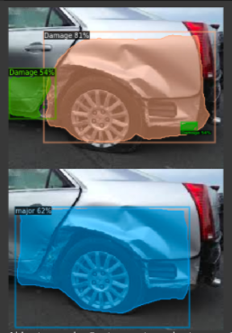

# Car-Damage-Project

This project was made for insurance companies to help them for automating Car insurance process.
Above are two notebooks.
1. Car Damage classification(Damaged or not)
2. Car Damage location and severtiy of damage detection.

I have trained models and custom dataset using Pytorch. 
Above code is just an example on one image.

Thank you!
 
 
