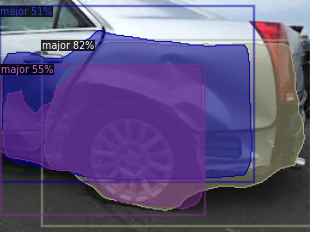

# Car-Damage-Project

This project was made for one of the insurance company to automate Car Insurance claims process.
It works like, initially it classifis image where its damage or not,
if so then it identifies location of damage along with severity of damage (minor, major, saviour)
Project contains two notebooks:
      1. Damage Vs Undamage Classification.
      2. Detection of damage along with its severity.
      
Severity Identification                      
 

Damage Detection and most relevant case identification
 

